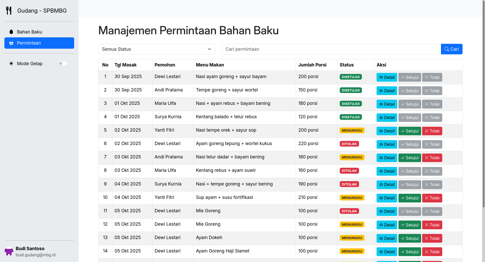
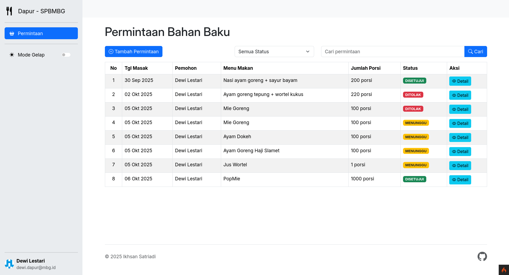
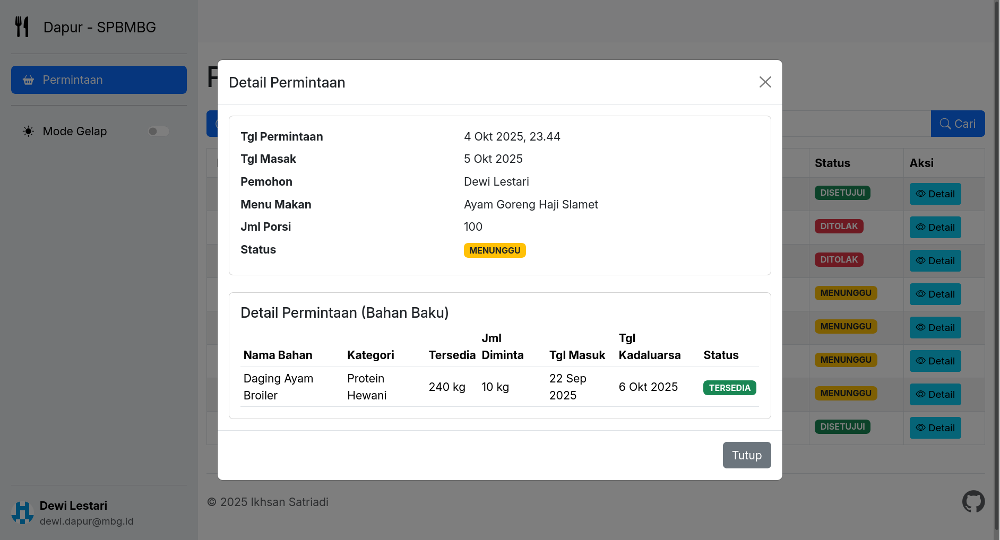
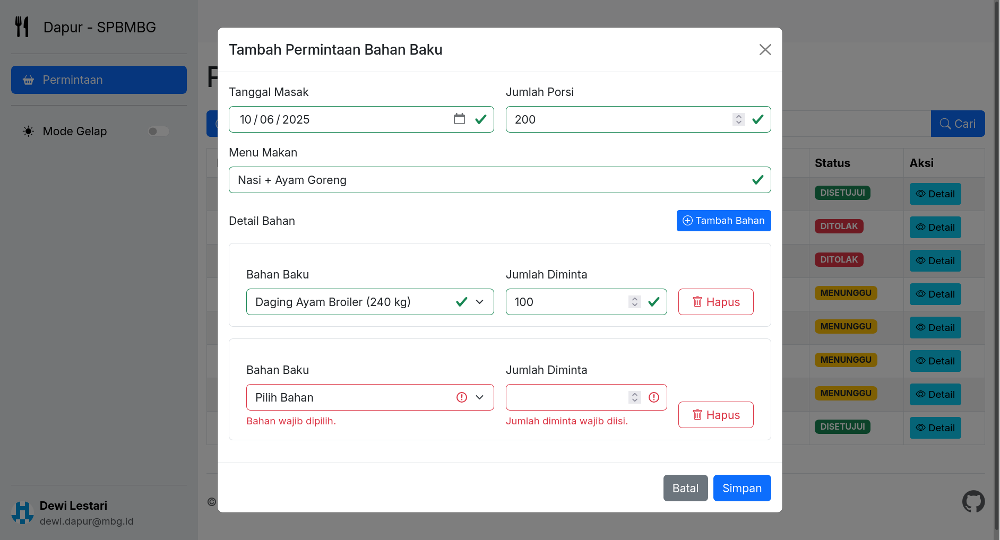

# Sistem Pemantauan Bahan Baku MBG



- Nama: Ikhsan Satriadi
- NIM: 241511080
- Prodi: D3 - Teknik Informatika
- Kelas: 2C

## Mata Kuliah Proyek 3: Pengembangan Perangkat Lunak Berbasis Web

### Deskripsi Proyek

Sistem Pemantauan Bahan Baku MBG (Makan Bergizi Gratis) dibuat untuk memudahkan pengawasan dan pengelolaan bahan baku makanan mengingat banyaknya kasus keracunan makanan yang terjadi.

### Teknologi yang Digunakan

- HTML5 & CSS3
- Bootstrap 5
- JavaScript (Fetch API)
- CodeIgniter 4 (Web + RESTful API)
- MySQL

### Preview Aplikasi

| Login                       | Bahan Baku (Gudang)                 |
| --------------------------- | ----------------------------------- |
|  |  |

| Permintaan Bahan Baku (Gudang)                                | Permintaan Bahan Baku (Dapur)                               |
| ------------------------------------------------------------- | ----------------------------------------------------------- |
|  |  |

| Detail Permintaan (Dapur/Gudang)                    | Tambah Permintaan Bahan Baku (Dapur)                            |
| --------------------------------------------------- | --------------------------------------------------------------- |
|  |  |

### Cara Menjalankan

1. Clone repository ini ke dalam direktori server lokal Anda.

2. Jalankan perintah composer untuk menginstal dependensi yang diperlukan.

   ```bash
   composer install
   ```

3. Buat database baru di MySQL bernama `mbg_db` (bisa disesuaikan di `.env`) dan impor [file SQL](mbg_db.sql) yang telah disediakan.

    > Sampel data instance terdapat di [mbg_db_data_instance.sql](mbg_db_data_instance.sql).

4. Salin file `env` dan rename menjadi `.env` dan sesuaikan konfigurasi database sesuai dengan pengaturan lokal Anda.

5. Jalankan server pengembangan CodeIgniter.

   ```bash
   php spark serve
   ```

6. Buka browser dan akses `http://localhost:8080` untuk melihat aplikasi berjalan.
