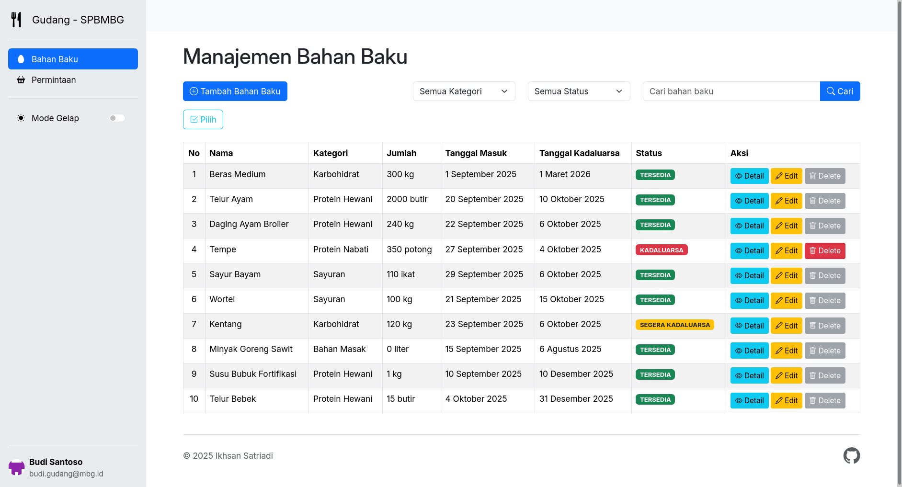
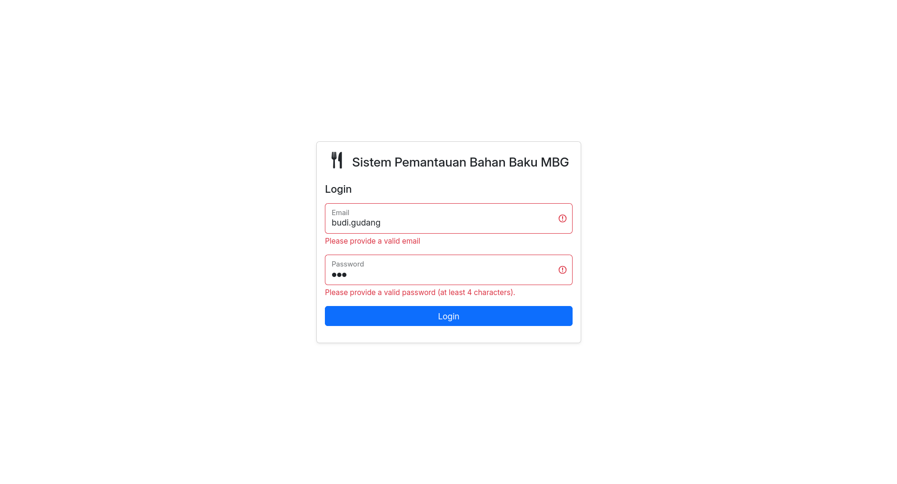

# Sistem Pemantauan Bahan Baku MBG



- Nama: Ikhsan Satriadi
- NIM: 241511080
- Prodi: D3 - Teknik Informatika
- Kelas: 2C

## Mata Kuliah Proyek 3: Pengembangan Perangkat Lunak Berbasis Web

### Deskripsi Proyek

### Cara Menjalankan

1. Clone repository ini ke dalam direktori server lokal Anda.

2. Jalankan perintah composer untuk menginstal dependensi yang diperlukan.

   ```bash
   composer install
   ```

3. Buat database baru di MySQL bernama `mbg_db` (bisa disesuaikan di `.env`).
4. Jalankan perintah migrasi untuk membuat tabel yang diperlukan.

   ```bash
   php spark migrate --all
   ```

5. Salin file `env` dan rename menjadi `.env` dan sesuaikan konfigurasi database sesuai dengan pengaturan lokal Anda.
6. Jalankan server pengembangan CodeIgniter.

   ```bash
   php spark serve
   ```

7. Buka browser dan akses `http://localhost:8080` untuk melihat aplikasi berjalan.


